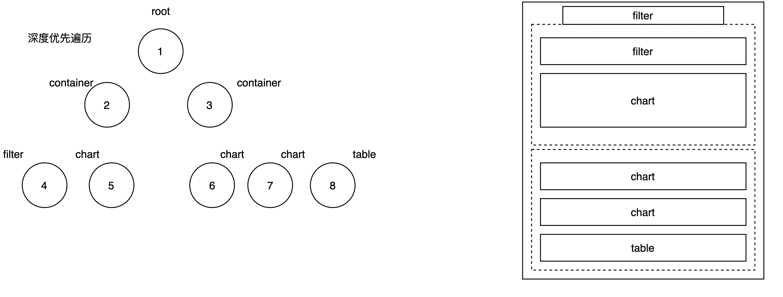

# LowCode

### 低代码开发平台 LCDP - Do More With Less

Low 是代码量

Hight: 高复用, 高效率, 易维护 & 逻辑可控

适合门户首页， 营销页面, 活动页面是lowcode 场景，因为功能标准， 逻辑简单

简而言之: 低代码是一种将权力重新交到你手上的智能方式

```
               复杂
                |
     lowcode    |  定制开发
标准化------------------------定制化
      lowcode   |  组件化
                |
               简单
```


低代码可以帮助企业:

**节省时间**: 使公司中几乎所有员工都可以开发应用, 而无需等待开发团队

**提高工作效率** 减少开发人员的日程安排，使其专注于构建需要编码的应用

**降低成本** 允许企业助力现有非开发员工, 转为平民开发者，而无需雇佣新的开发人员

**提高灵活性** 使用低代码平台轻松更改应用, 而无需花大量时间编写代码


### lowcode 原理

lowcode核心

* 可视化配置面板
* 扩展能力-组件，模板, 逻辑复用
* 生命周期管理 - 开发管理、页面管理、部署管理


kowcode功能

* 页面管理
* 配置页面
  * 组件库 (物料堆)
  * 配置画布 (舞台)
  * 配置项 (配置面板)
  * 顶栏(全局 / 页面配置)

* 输出页面


IDE ----------------> 页面配置转换为JSON协议， 描述页面-----
--------> 渲染还原

lowcode渲染的时候应该选择 深度优先遍历, 从上到下渲染dom, 优先出首屏

