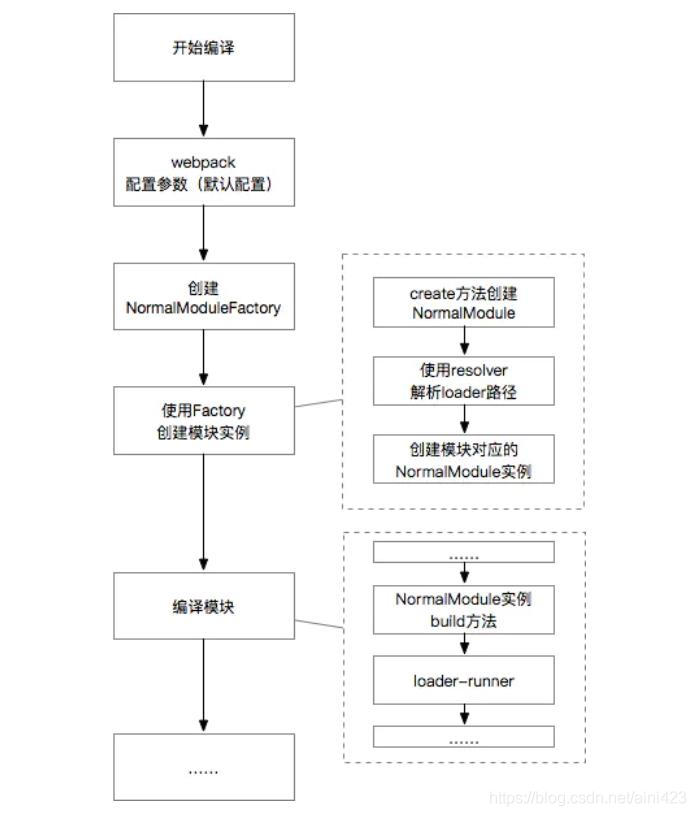
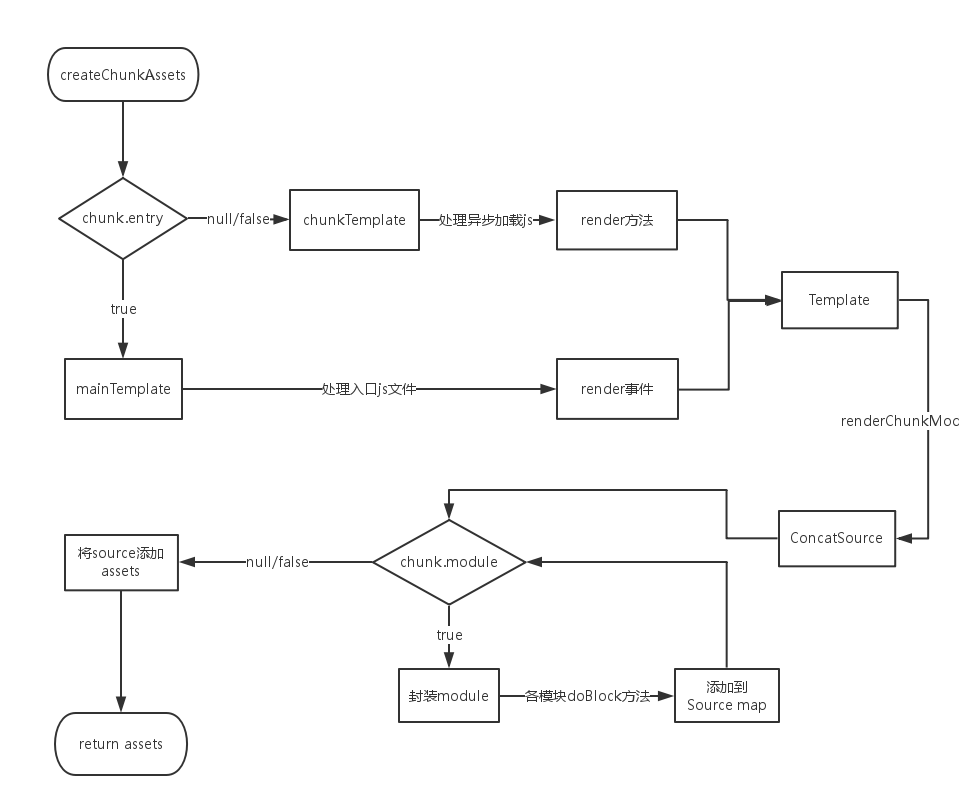

## webpack工作流程

### 宏内核

将运行核心，和插件模块聚合在一起，运行速度比微内核快，但是不容易扩展， 并且一旦某个内核模块出现异常，整个宏内核都将崩溃


与宏内核相比，微内核扩展更方便，一个插件的损坏不会影响这个架构, 加强了系统的健壮性， 移植性更强

### 微内核架构

**微内核架构模式**直白的讲就是*插件模式*。但是，单纯的说插件系统又不是很准确。

**核心 **是一个调度器，只提供通用的业务逻辑或接口规范，没有实际的业务模块，

**插件** 是一个专业处理额外特性的独立组件, 插件之间也可以互相依赖。

**连接到核心系统** 插件模块可以通过多种方式连接到核心模块

1. OSGI
2. 消息机制
3. web服务
4. 点对点的绑定(对象实例化， 依赖注入)

**通信规范** 插件模块和核心系统之间的通信规范分为`标准规范`和`自定义规范`，自定义规范通常是指某个插件模块是由第三方服务开发的。这种情况下，就需要在自定义规范和标准规范之间提供一个Adapter，这样核心系统就不需要关心每个插件模块的具体实现。

**事件模式** 核心系统提供了多种事件模式，主要包括常用的点对点模式、发布订阅模式。同时，事件的类型分为全局（系统级）事件、系统内部事件以及插件模块内部事件。由于点对点模式中发送者和接收者之间没有依赖关系并且一条消息只对应一个接收者，所以可以用作广播全局（系统级）事件，比如调起某个插件模块。而发布订阅模式中订阅者和发布者之间存在时间上的依赖性，可以用于系统内部事件和插件模块的内部事件。此外，核心模块也可以通过发布订阅模式向外发布某些属于业务基本操作规则的事件。

**接口设计**当插件模块注册到核心系统之后，通过系统级事件可以调起具体的某插件模块。此时就需要核心模块提供属于基本操作规则的接口供插件模块使用，同样的，插件模块也必须按照通信规范提供`运行入口(类似于java的Main方法)`和`数据规范(参数格式，返回的数据格式)`，以此保障插件模块可以在核心系统上正确运行。插件模块是独立于核心系统之外的，但是根据具体的需求（`提供单纯的数据服务`、`处理系统数据和信息`）可能会需要操作核心模块的系统服务做一些定制化功能，此时核心系统需要提供一个上下文对象（Context），且插件模块与外部进行交互只能通过此上下文对象。上下文对象提供了基础操作（调起其他插件模块、调起系统服务、获取系统信息）的API和事件。

**插件注册和调起** 插件提供一个可执行js, 实例化后就完成了注册， `内核`模块， 各个生命周期的hooks中会依次调用各插件的hooks函数

​	

#### webpack

webpack 打包是一种事件流机制

**核心 ** tapable.js 提供了synchook和asynchook, 

**插件**  webpack plugin

**连接到核心系统**  点对对实例化

**通信规范**  

**事件模式**  tapable的synchook和asynchook

**接口设计**。

**插件注册和调起** 

#### webpack 工作流程

##### webpack 准备阶段

***Compiler**初始化，加载内部插件*

1. run  

   开始执行webpack , 如果是watch状态就执行watch-run

2. compile 

   生成**createNormalModuleFactory**和**createContextModuleFactory**，并传入**compilation**,为后面**modules和chunks的生成阶段**做准备

3. make

   make钩子触发,相应插件运行,开始进入**modules和chunks的生成阶段**

##### modules和chunks的生成阶段

这个阶段的主要内容，是先解析项目依赖的所有 modules，再根据 modules 生成 chunks。
**module 解析**，包含了三个主要步骤：创建实例、loaders应用以及依赖收集。
**chunks 生成**， 主要步骤是找到 chunk 所需要包含的 modules。

1. module 解析

当上一个阶段make钩子被触发，此时内部入口插件（**SingleEntryPlugin, MultiEntryPlugin, DynamicEntryPlugin**）监听器会开始执行。监听器都会调用 **Compilation** 实例的 **addEntry** 方法，该方法将会触发第一批 module 的解析，这些 module 就是 **entry** 中配置的入口模块。


2. chunks 生成
   * webpack 先将 entry 中对应的 module 都生成一个新的 chunk
   * 遍历 module 的依赖列表，将依赖的 module 也加入到 chunk 中
   * 如果一个依赖 module 是动态引入的模块，那么就会根据这个 module 创建一个新的 chunk，继续遍历依赖
   * 重复上面的过程，直至得到所有的 chunks

##### 文件生成

1. 模板 hash 更新

   在开始渲染之前，Compilation 实例会调用 createHash 方法来生成这次构建的 hash。在 webpack
   的配置中，我们可以在 output.filename 中配置 [hash] 占位符，最终就会替换成这个 hash。同样，createHash 也会为每一个 chunk 也创建一个 hash，对应 output.filename 的 [chunkhash] 占位符。

2. 模板渲染 chunk

   当 hash 都创建完成之后，下一步就会遍历 compilation.chunks 来渲染每一个 chunk。如果一个 chunk 是入口 chunk，那么就会调用 MainTemplate 实例的 render 方法，否则调用 ChunkTemplate 的 render 方法

   

3. 生成文件

   在 Compiler 实例开始生成文件前，最后一个修改最终文件生成的任务点 emit 会被触发：
   当任务点 emit 被触发之后，接下来 webpack 会直接遍历 compilation.assets生成所有文件，然后触发任务点 done，结束构建流程。


#### koa

koa.application 是core, 各种middleware 是插件系统

koa-router 既是一个koa插件, 它本身也是一个微内核， router中注册的各种自定义的路由 又是koa-router的中间件/插件

#### 微前端


### 总结

1. **初始化参数：从配置文件和 Shell 语句中读取与合并参数，得出最终的参数；**
2. **开始编译：用上一步得到的参数初始化 Compiler 对象，加载所有配置的插件，执行对象的 run 方法开始执行编译；**
3. **确定入口：根据配置中的 entry 找出所有的入口文件；**
4. **编译模块：从入口文件出发，调用所有配置的 Loader 对模块进行翻译，再找出该模块依赖的模块，再递归本步骤直到所有入口依赖的文件都经过了本步骤的处理；**
5. **完成模块编译：在经过第4步使用 Loader 翻译完所有模块后，得到了每个模块被翻译后的最终内容以及它们之间的依赖关系；**
6. **输出资源：根据入口和模块之间的依赖关系，组装成一个个包含多个模块的 Chunk，再把每个 Chunk 转换成一个单独的文件加入到输出列表，这步是可以修改输出内容的最后机会；**
7. **输出完成：在确定好输出内容后，根据配置确定输出的路径和文件名，把文件内容写入到文件系统**


## webpack 打包es6


1. webpack 打包es6和es5  2份bundle
2. 判断ua和script module + crossorigin="annonymous"下发es6, 因为nomodule兼容不好，所以没有完全依靠m


## webpack tree-sheeking

基于静态代码检查，排查export 出去的模块是否被import ,如果没有打包时就会被移除.

如果是内部成员 没有使用 就无法移除

```js
// ./index.js（入口文件）
import obj from './utils';

console.log(obj.a());


// ./utils.js
const obj = {
  a: function(){
   return 'a';
  },
  // b就没有移除
  b: function(){
   return 'b';
  },
}
export default obj
```


## webpack5

