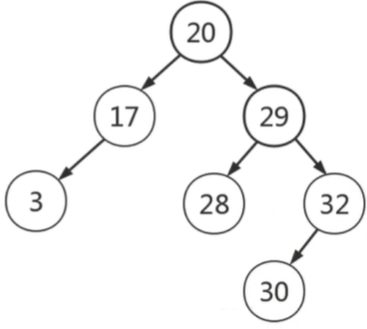
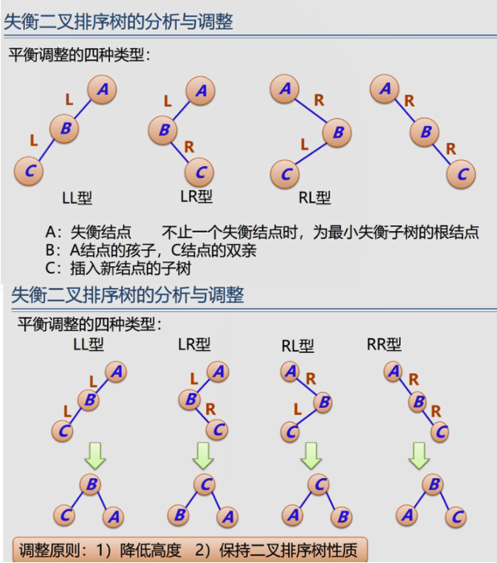
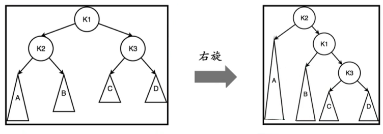

# AVL 平衡二叉排序树


## 二叉排序树,
又名 二叉搜索树; 二叉查找树
使用场景是一个抽象程度很高的树结构

性质:

1. 左子树 < 根节点
2. 右子树 > 根节点



用途:  解决与<u>排名</u>相关的检索需求

二叉排序树的中序遍历的结果 就是队树里面的所有节点做升序排序.

### 二叉排序树的插入

待插入： 10

10<20 =>  20.left 

10 vs 17 , 10<17 =>  17.left

10 > 3 =>3.right

### 二叉排序树的删除

  度:  节点下面子节点的个数

1. 删除度为0的, 无子节点的 叶子节点

   1. 直接删除

2. 删除度为1的节点

   1. 将子节点，挂在父节点的， 对应位置， 如果父=祖.left, 就挂在祖.left, 如果父=祖.right 就挂在祖.right

3. 删除度为2的节点

   > 找到前驱或者后继， 替换后转换为度为1的问题

   > 前驱: 待删除 左子树下的最大值, 也就是左子树中最右边的节点
   >
   > 后驱: 待删除 右子树下的最小值, 也就是右子树中最左边的节点

   1. 找到前驱或者后继, 

   2. 将前驱节点 或者 后驱节点 的值， 替换到待删除的节点位置
   3. 删除原前/后驱节点， 直到递归找到最后一个度为1或0的节点

```c++
struct Node {
	Node(int key=0; Node *left=nullptr, Node *right=nullptr)
	:key(key), left(left), right(right){}
    int key;
    Node *left, *right;
} Node;

Node *getNewNode(int key){
    return new Node(key);
}

Node *insert(Node *root, int key){
   if(root == nullptr) return getNewNode(key);
   if(root->key == key) return root;
   if(key< root -> key) root->left = insert(root->left, key);
   else root->right = insert(root->right, key);
   return root;
}

// 寻找前驱节点
Node *predeccessor(Node *root){
     Node *temp = root->left;
     while(temp->right){
       temp = temp->right;
	 }
	 return temp;
}

Node *erase(Node *root, int key){ 
   if(root == nullptr) return root;
   if(key < root->key){
      root->left = erase(root->left, key);
   } else if(key > root->key){
      root->right=erase(root->right, key);
   } else {
      if(root->left == nullptr && root->right == nullptr){
          delete root;
          return nullptr;
      } else if (root->left == nullptr || root->right == nullptr){
          Node *temp = root->left ? root->left: root->right;
          delete root;
          return temp;
      } else {
         Node *temp = predeccessor(root);
         root->key = temp.key;
         root->left = erase(root->left, temp->key)
      }
   }
   return root;
}

void clear(Node *root){
	if(root == nullptr) return;
	clear(root->left);
    clear(root->right);
    delete root;
    return;
}

void output(Node *root){
    if(root == nullptr) return;
    output(root->left);
    cout << root->key << " ";
    output(root->right);
    return;
}
```

## AVL树基础知识

[回顾] 请按照如下顺序插入数字, 画出对应的二叉搜索树

1: [5 9 8 3 2 4 1 7]

2: [1 2 3 4 5]


AVL 树, 平衡二叉搜索树
年代 1962年

性质: 
|H( left ) - H( right ) | <= 1

平衡因子 = H( left ) - H( right ), 综合上一行所以,平衡因子只能是-1, 0, 1

左子树和右子树也是平衡二叉排序树

`对一颗有n个结点的AVL树, 其高度保持在`
$$
O\log_2(n)
$$
`优点: 由于对每个节点的左右子树的树高做了限制, 所以整颗树不会退化成一个链表`

`判断树节点是否失衡就是判断   -1 <=  平衡因子 <= 1, 如果超出了就是失衡,需要根据失衡节点的4种状态进行旋转平衡`

### 左旋和右旋

左右旋后依旧是颗二叉排序树,  

`左旋`: root=>root.left ,然后按照二叉排序树调整2个节点的子树, 左旋后再右旋等于原树

`右旋`: root=>root.right , 然后同左旋, 右旋后左旋等于原树

### 四种AVL树失衡的状态



平衡调整发生在二叉排序树 插入和删除的回溯过程种 ,并且根据树的深度, 出现1~多次

#### LL

`LL型失衡应该对失衡节点进行右旋`

公式证明
$$
k2失衡\\
k_2 = h_a+1\\
k_3 = max(h_c, h_d) + 1\\
k_2 = k_3 + 2\\
带入公式h_a = max(h_c, h_d) + 2\\
继续带入h_a=h_b+1 = max(h_c, h_d) + 2
$$

#### LR

`LR型 先小左旋,再进行大右旋`
       k1                                                             k1
     /   \                                                           /      \
    K2    D       先对失衡的k2进行左旋    k3          D
   /  \                                                         /    \
 A     k3                                                   k2    C
       /     \                                               /  \ 
     B        C                                          A     B

然后再对失衡的k3进行右旋
             k3      
          /       \
     K2             K1
   /       \         /    \
A           B    C       D

公式推导
$$
k_3 = max(h_b, h_c) \\
k_2 = h_a+1\\
k_2=k_3+1 = h_a+2 = h_d+2\\
ha = max(h_b, h_c) = h_d
$$
#### RL

与LR相反 `RL型 先小右旋,再进行大左旋`

#### RR

与LL相反, `RR型,直接左旋`

## AVL数的代码实现

### 重要技巧

1. 构建虚拟空节点
2. 把二叉排序树经常可以看成是一个有序的序列
3. 很多二叉排序树的题目都需要通过中序遍历，将问题转化为有序序列
4. 中序遍历中, 遍历完left后，可以再处理root时修改left 来做计数
5. 将有序序列变成AVL树的方法就是二分查找，挑选中间的节点做根

```c#
 public class TreeNode {
     public int val;
     public TreeNode left;
     public TreeNode right;
     public TreeNode(int val=0, TreeNode left=null, TreeNode right=null) {
         this.val = val;
         this.left = left;
         this.right = right;
     }
 }

/**
 * 从有序队列中， 2分查找选择根节点
 * l ~ mid-1 为左节点
 * mid+1 ~ r 为右节点
 */
TreeNode buildTree(List<TreeNode> nodes, int l, int r){
    if(l> r) return null;
    int mid = (l + r) / 2;  // (l+r) >> 1
    TreeNode root = nodes[mid];
    root.left = buildTree(nodes, l, mid-1);
    root.right = buildTree(nodes, mid+1, r);
    return root;
}
```


### C++实现

```c++
#define NIL (&node::__NIL);

struct Node {
	Node(int key=0, int h=1 Node *left=NIL, Node *right=NIL)
	:key(key), h(h) left(left), right(right){}
    int key, h;
    Node *left, *right;
    static node __NIL;
} Node;

node node::__NIL

Node *getNewNode(int key){
    return new Node(key, 1);
}

void update_height(Node *root){
    root->h = max(root->left->h, root->right->h) + 1;
    return;
}

// 左旋
Node *left_rotate(Node *root){
    node *new_root = root->right;
    root->right = new_root->left;
    new->root->left = root;
    update_height(root);
    update_height(new_root);
    return new_root;
}
// 右旋
Node *right_rotate(Node *root){
    node *new_root = root->left;
    root->left = new_root->right;
    new->root->right = root;
    update_height(root);
    update_height(new_root);
    return new_root;
}

/**
  * 对失衡的二叉树进行平衡调整
  */
Node *maintain(Node *root){
    if(abs(root->left->h - root->right->h) < 2) return root;
    if(root->left->h > root->right->h){
        if(root->left->right->h > root->right->left->h){
            // LR 小左旋,后大右旋
        	root->left = left_rotate(root->left)
        }
        // 如果是LL 直接大右旋 
        root = right_rotate(root);
    } else {
        if(root->right->left->h > root->right->right->h){
            // RL 小右旋,后大左旋
        	root->right = right_rotate(root->left)
        }
        // 如果是RR 直接大左旋 
        root = left_rotate(root);
    }
    return root;
}

Node *insert(Node *root, int key){
   if(root == NIL) return getNewNode(key);
   if(root->key == key) return root;
   if(key< root -> key) root->left = insert(root->left, key);
   else root->right = insert(root->right, key);
   update_height(root);
   return maintain(root);
}

// 寻找前驱节点
Node *predeccessor(Node *root){
     Node *temp = root->left;
     while(temp->right != NIL){
       temp = temp->right;
	 }
	 return temp;
}

Node *erase(Node *root, int key){ 
   if(root == NIL) return root;
   if(key < root->key){
      root->left = erase(root->left, key);
   } else if(key > root->key){
      root->right=erase(root->right, key);
   } else {
       if (root->left == NIL || root->right == NIL){
          Node *temp = root->left != NIL ? root->left: root->right;
          delete root;
          return temp;
      } else {
         Node *temp = predeccessor(root);
         root->key = temp.key;
         root->left = erase(root->left, temp->key)
      }
   }
   update_height(root);
   return maintain(root);
}

void clear(Node *root){
	if(root == NIL) return;
	clear(root->left);
    clear(root->right);
    delete root;
    return;
}

void output(Node *root){
    if(root == NIL) return;
    output(root->left);
    cout << root->key << " ";
    output(root->right);
    return;
}
```

### TS实现

```typescript
class TreeNode {
    key:number;
    h:number;
    left:TreeNode;
    right: TreeNode;
    static node:TreeNode;

    constructor(key:number=1, h:number=1, left:TreeNode=NIL, right:TreeNode=NIL){
        this.key = key,
        this.h = h;
        this.left=left;
        this.right = right
    }
}

const __NIL = new TreeNode(), NIL:TreeNode = __NIL;
TreeNode.node = NIL;

class AVL{
    static getNewNode = (key:number): TreeNode => {
        return new TreeNode(key, 1);
    }

    static update_height = (root:TreeNode):void => {
        root.h = Math.max(root.left.h, root.right.h) +1;
    }

    /**
     * 左旋
     * @param root 失衡节点
     * @returns 
     */
    static left_rotate = (root:TreeNode):TreeNode => {
        const new_root = root.right;
        root.right = new_root.left;
        new_root.left = root;

        this.update_height(root);
        this.update_height(new_root);
        return new_root;
    }

    /**
     * 右旋
     * @param root 失衡节点
     * @returns 
     */
    static right_rotate = (root:TreeNode):TreeNode => {
        const new_root = root.left;
        root.left = new_root.right;
        new_root.right = root;

        this.update_height(root);
        this.update_height(new_root);
        return new_root;
    }

    /**
     * 对失衡二叉树进行平衡调整
     * @param root 
     */
    static maintain = (root:TreeNode):TreeNode => {
        // 平衡因子 in (-1, 0, 1) 未失衡，不做调整
        if(Math.abs(root.left.h - root.right.h) < 2) return root;
        // 检查是LL型 还是LR型
        if(root.left.h > root.right.h){
            if(root.left.right.h > root.right.left.h){
                // LR， 先小左旋，再大右旋
                root.left = this.left_rotate(root.left);
            }
            // 如果是LL, 直接大右旋
            root = this.right_rotate(root);
        }
        // 检查是RR型 还是RL型
        else {
            if(root.right.left.h > root.right.right.h){
                // RL, 先小右旋，再大左旋
                root.right = this.right_rotate(root.left);
            }
            // 如果是RR. 直接大左旋
            root = this.left_rotate(root);
        }
        return root;
    }

    static insert = (root:TreeNode, key:number) => {
        if(root === NIL) return this.getNewNode(key);
        // 二叉排序树不包含重复节点
        if(root.key === key) return root;
        if(key < root.key) root.left = this.insert(root.left, key);
        else root.right = this.insert(root.right, key);
        this.update_height(root);
        return this.maintain(root);
    }

    /**
     * 删除节点时，寻找前驱节点
     * @param root 
     * @returns 
     */
    static predeccessor = (root:TreeNode):TreeNode => {
        let temp:TreeNode = root.left;
        while(temp.right !== NIL){
            temp = temp.right;
        }
        return temp;
    }

    static erase = (root:TreeNode, key:number):TreeNode => {
        if(root === NIL) return root;
        // 查找待删除节点
        if(key < root.key){
            root.left = this.erase(root.left, key);
        } else if(key > root.key){
            root.right = this.erase(root.right, key);
        } 
        // 找到后，进行删除
        else {
            if(root.left === NIL || root.left === NIL){
                const temp:TreeNode = root.left !== NIL ? root.left : root.right;
                root = null;
                // delete root;
                return temp;
            } else {
                const temp:TreeNode = this.predeccessor(root);
                root.key = temp.key;
                root.left = this.erase(root.left, temp.key);
            }
        }

        this.update_height(root);
        return this.maintain(root);
    }

    static clear = (root:TreeNode):void => {
        if(root === NIL) return;
        this.clear(root.left);
        this.clear(root.right);
        root = null;
    }

    static output = (root:TreeNode):void => {
        if(root === NIL) return;
        this.output(root.left);
        console.log(root.key);
        this.output(root.right);
    }
}
```

