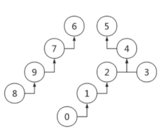

## 并查集

### 连通性问题

并查集主要是解决连通性问题, 传递性

a-b]

​        ===> a -c

b-c]

**并查集是一类抽象化程度很高的数据结构**

### Quick-Find算法(染色法)

每次连接的时候，连接的是2个集合

1. 基于`染色`思想, 一开始所有的点颜色不同
2. 连接两个点的操作，可以看成将一种`颜色`的点染成`另一种颜色`
3. 如果两个点颜色<u>一样</u>， 证明联通，否则不联通
4. 这种方法叫做并查集的 [Quick-Find]算法

```c++
class UnionSet {
    public :
       int *color ,n;
       UnionSet(int n): n(n) {
           color = new int[n+1];
           for(int i=0;i<=n;i++){
               color[i]=i;
           }
       }
       int find(x){ // O(1)
           return color[x]
       }
       void merge(int a, int b){ // O(n)
           if(color[a] == color[b]) return;
           int cb = color[b];
           // b的颜色染成a的颜色
           for(int i=0;i<=n;i++){
               if(color[i] == cb) color[i]=color[a];
           }
           return;
       }
}
```


1. 联通判断: O(1)
2. 合并操作: O(n)


问题思考：

1. quick-find 算法的联通判断非常快，可是合并操作非常慢

2. 本质上问题中只是需要知道一个点与哪些点的颜色相同

3. 而若干点的颜色可以通过间接指向同一个节点

4. 合并操作时，实际上是将一颗树作为另一颗树

   

### Quick-Union算法

使用树形结构

```c++
class UnionSet {
    public :
       int *boss, n
       UnionSet(int n): n(n) {
           boss = new int[n+1];
           for(int i=0;i<=n;i++){
               boss[i]=i;
           }
       }
       int find(x){ // O(1)
		  if(boss[x] == x) return;
           find(boss[x]);
       }
       void merge(int a, int b){ // O(n)
           int fa = find(a), fb=find(b);
           if(fa == fb) return;
           boss[fa]=fb;
           
           return;
       }
}
```

1. 联通判断: tree-height 树高
2. 合并操作: tree-height 树高



问题思考

1. 极端情况下会退化成一条链表
2. 将节点数量多的接到少的树上面，导致退化
3. 将树高深的接到浅的上面，导致了退化


*指标:: 平均查找次数 = 节点的总查找次数/n (n为节点数)*

有效压缩树高可以优化Quick-Union

2个树合并的时候，选择节点多的树作为合并后的父树

a: Sa La

b: Sb La

S是节点数, 	La是总查询次数

a为爸爸

(la + lb + sb)/(sa+sb)  // 因为a为父, b的深度+1, 总查询次数+sb

b为爸爸

(la+lb+sa)/(sa+sb) 

比较结果就是2棵树，节点多的当爸爸，平均查找效率最高

按秩优化后的算法

```js
class UnionSet {
    public :
       int *fa, *size,n
       UnionSet(int n): n(n) {
           fa = new int[n+1];
           size = new int[n+1]
           for(int i=0;i<=n;i++){
               fa[i]=i;
               size[i]=i;
           }
       }
       int find(x){ // O(1)
		  if(fa[x] == x) return;
           find(fa[x]);
       }
       void merge(int a, int b){ // O(n)
           int ra = find(a), rb=find(b);
           if(ra == rb) return;
           if(size[fa] < size[fb]){
               fa[ra] = rb;
               size[rb] += size[ra]
           } else {
               fa[rb] = ra;
               size[ra] += size[rb]
           }

           
           return;
       }
}
```
### 路径压缩

每次find查询后, 将查询到的节点挂到根节点下

```c++
class UnionSet {
    public :
       int *fa, *size,n
       UnionSet(int n): n(n) {
           fa = new int[n+1];
           size = new int[n+1]
           for(int i=0;i<=n;i++){
               fa[i]=i;
               size[i]=i;
           }
       }
       int find(x){ // O(1)
		  if(fa[x] == x) return;
           int root = find(fa[x]);
           fa[x] = root;
           retutn root;
       }
       void merge(int a, int b){ // O(n)
           int ra = find(a), rb=find(b);
           if(ra == rb) return;
           if(size[fa] < size[fb]){
               fa[ra] = rb;
               size[rb] += size[ra]
           } else {
               fa[rb] = ra;
               size[ra] += size[rb]
           }

           
           return;
       }
}
```

通常使用中只使用路径压缩, 没有按序优化, 因为路径压缩代码简单， 提升很明细

```c++
class UnionSet {
    public :
       int *fa,n
       UnionSet(int n): n(n) {
           fa = new int[n+1];
           for(int i=0;i<=n;i++){
               fa[i]=i;
           }
       }
       int find(x){ // O(1)
		  if(fa[x] == x) return;
           int root = find(fa[x]);
           fa[x] = root;
           retutn root;
       }
       void merge(int a, int b){ // O(n)
           int ra = find(a), rb=find(b);
           if(ra == rb) return;
           fa[ra]=rb;           
           return;
       }
}
```

### 并查集模板代码

c++ 模板为竞赛模板

```c++
class UnionSet {
    public :
       int *fa,n
       UnionSet(int n): n(n) {
           fa = new int[n+1];
           for(int i=0;i<=n;i++){
               fa[i]=i;
           }
       }
       int get(x){ // O(1)
          return fa[x] = (fa[x] == x ? x: get(fa[x])) ;
       }
       void merge(int a, int b){ // O(n)
           fa[get(a)] = get(b);
       }
}
```

```js
class UnionSet{
    fa= [];
    n= 0;

    constructor(n){
        this.n = n;
        this.fa = new Array(n+1);
        
        for(let i=0;i<=n;i++){
            this.fa[i]=i;
        }
    }

     get(x){
        const {fa} = this;
        if(fa[x] == x) return x;
        const root = this.get(fa[x]);
        fa[x] = root;
        return root;
    }

    merge(a, b){
        this.fa[this.get(a)] = this.get(b);
    }
}
```


###  Coding

#### 71 朋友圈

 所谓一个朋友圈子，不一定其中的人都互相直接认识。

 **例如：**小张的朋友是小李，小李的朋友是小王，那么他们三个人属于一个朋友圈。

 现在给出一些人的朋友关系，人按照从 11 到 nn 编号在这中间会进行询问某两个人是否属于一个朋友圈，请你编写程序，实现这个过程。

------

输入

第一行输入两个整数 n,m(1≤n≤10000，3≤m≤100000)n,m(1≤n≤10000，3≤m≤100000)，分别代表人数和操作数。

接下来 mm 行，每行三个整 a,b,c（a∈[1,2], 1≤b,c≤n）a,b,c（a∈[1,2], 1≤b,c≤n）

1. 当 a=1a=1 时，代表新增一条已知信息，b,cb,c 是朋友
2. 当 a=2a=2 时，代表根据以上信息，询问 b,cb,c 是否是朋友

 输出

对于每个 a=2a=2 的操作，输出『Yes』『Yes』或『No』『No』代表询问的两个人是否是朋友关系。

------

样例输入

```
6 5
1 1 2
2 1 3
1 2 4
1 4 3
2 1 3
```

样例输出

```
No
```

解答

```c++
/*quick-find*/
class UnionSet {
    public :
       int *color ,n;
       UnionSet(int n): n(n) {
           color = new int[n+1];
           for(int i=0;i<=n;i++){
               color[i]=i;
           }
       }
       int find(x){ // O(1)
           return color[x]
       }
       void merge(int a, int b){ // O(n)
           if(color[a] == color[b]) return;
           int cb = color[b];
           // b的颜色染成a的颜色
           for(int i=0;i<=n;i++){
               if(color[i] == cb) color[i]=color[a];
           }
           return;
       }
}

int main(){
    int n,m;
    cin >> n >> m;
    UnionSet u(n);
    for(int i=0;i<m;i++){
        int a,b,c;
        cin >> a >> b >> c;
        
        switch(a){
            case 1: u.merge(b,c);break;
            case 2: return u.find(b) == u.find(c) ? 'YES': 'NO'
        }
    }
}
```

#### leetcode 547

#### leetcode 200

**小技巧: 把二维坐标转成一维编号**


