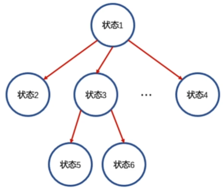
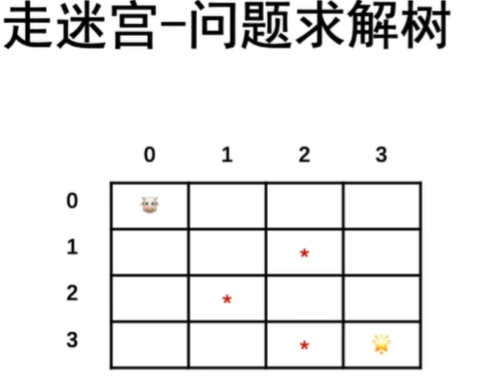
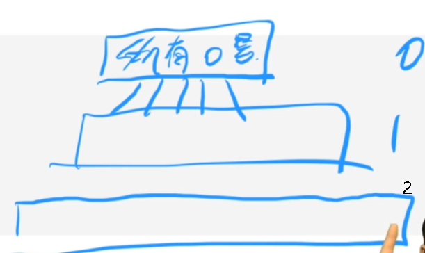

# BFS和DFS
问题状态空间

## 搜索的核心概念

问题求解树(问题状态树, 状态求解树)



经典问题，走迷宫



定义状态
求解树是思维结构中的一棵树

​         0,0
​       /       \
​     0,1      1,0
​    /  \         /  \
0,2   1,1  1,1  2,0


1. 什么是深搜和广搜？

对于问题求解数的不同遍历方式

2. 什么是搜索剪枝和优化？

排除某些问题求解树中子树的遍历过程， 不去搜索某些子树

3. 设计搜索算法的核心关键点是什么?

设计问题求解树中的状态


## DFS

通常情况下，使用递归实现深度优先遍历(DFS)

## BFS

通常情况下，使用队列实现BFS

BFS方便对于最优化问题的求解, 比如最短距离

## Coding

如果BFS和DFS都行，建议能用DFS就用DFS， 因为BFS会开辟一段空间

993 dfs bfs都可以

542  

方向数组

```js
class Data{
    i:number;
    j:number;
    k:number;

    constructor(i:number, j:number, k:number){
        this.i=i;
        this.j=j;
        this.k=k;
    }
}

function init_queue(q:Data[], vis:number[][], n:number, m:number, mat: number[][]){
    for(let i=0;i<n;i++){
        vis[i] = [];
        for(let j=0;j<m;j++){
            vis[i][j]=-1;
        }
    }
    for(let i=0;i<n;i++){
        for(let j=0;j<m;j++){
            if(mat[i][j] > 0) continue
            vis[i][j]=0;
            q.push(new Data(i,j,0));
        }
    }
}

// 上下左右4个格子的偏移量
const dir:number[][] = [
    [0,1],
    [1,0],
    [0,-1],
    [-1,0]
];

function updateMatrix(mat: number[][]): number[][] {
    // bfs队列
    const q:Data[] = [];
    // 方向数组
    const vis:number[][] = [];
    const n = mat.length, m = mat.length > 0 ? mat[0].length : 0;
    init_queue(q, vis, n, m, mat);
    while(q.length > 0) {
        const cur = q[0]; // 取状态
        // 扩展状态
        for(let k=0;k<4;k++){
            let x = cur.i + dir[k][0];
            let y = cur.j + dir[k][1];
            if(x < 0 || x >= n) continue;
            if(y < 0 || y >= m) continue;
            if(vis[x][y] != -1) continue;
            vis[x][y] = cur.k + 1;
            q.push(new Data(x, y, cur.k+1));
        }
        q.shift(); //出状态
    }
    return vis;
};
```


1091

752

剑指offer13
