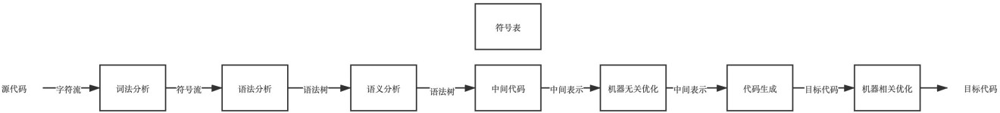
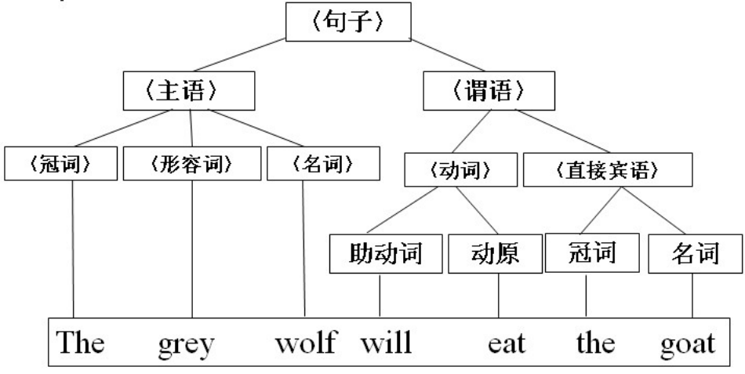

# 编译原理

## 1.编译与编译器

<strong>编译</strong> 

> 把一门语言编写的程序 (源程序) 翻译成另外一门语言程序 （目标代码）

<b>编译器</b>

> 完成编译工作的程序


## 2. 编译流程

程序的编译是一个系统性的知识(也是大学计算机专业的主课程)。 一个编译器通常包含如下步骤:




### 2-1 词法分析

词法分析是编译的第⼀步，主要任务是读⼊源程序的输⼊字符，将其组成词素（Token ：单词、符号等元素）并标记词素类型 （如字符串、数字、运算符、关键字等）和词素位置（⾏列），这个阶段也包含⼀些预处理任务，如过滤合并空格、注释……

等。

<b>有限状态⾃动机（FSM/FSA） </b>

> 研究事物解决能力的一种有效模型
>
> - 数字电路设计
> - 通信协议
> - 词法分析 （去除注释）

[深入浅出理解有限状态机](https://zhuanlan.zhihu.com/p/46347732)


### 2-2 语法分析 

语法分析是根据某种给定的 <u>形式⽂法</u> 对词法分析阶段得到的 Token 进⾏分析并确定其语法结构的过程。 

<b>形式⽂法</b>指的是字符串序列在某种语⾔中⽂法组织规则，如⾃然语⾔中的肯定句、疑问句，程序中的 条件、循环、赋值等。

<b>巴科斯范式 </b>

⼀种⽤来描述（表示）某种语⾔⽂法的范式（符号集），⼴泛应⽤于各种程序设计语⾔。 

```
ImportStatement	::=	"import" Name ( "." "*" )? ";"
VariableStatement	::=	"var" VariableDeclarationList ( ";" )?
VariableDeclarationList	::=	VariableDeclaration ( "," VariableDeclaration )*
VariableDeclarationListNoIn	::=	VariableDeclarationNoIn ( "," VariableDeclarationNoIn )*
```

<u>产⽣式</u>：⽂法格式，推导规则（⾮终结符的分解规则）。  指的ImportStatement VariableStatement

<u>⾮终结符</u>：可再分解推导的内容。 上图中的VariableDeclarationList, ariableDeclaration, VariableDeclarationNoIn 可以继续分解的

<u>终结符</u>：不可再分解推导的内容。 上图中的 "var"

[JS语法形式的定义](https://tomcopeland.blogs.com/EcmaScript.html)

[JS 图片描述 文法组成形式](https://www.oreilly.com/library/view/javascript-the-good/9780596517748/apd.html)




当定义了语⾔的⽂法后，如何去分析给定字符串内容是否符合该语⾔定义的⽂法就是后续 ⽂法解析 要考虑的事情了。

<b>LL分析器</b>

<b>AST</b>

### 2-3 语义分析

借助程序相关性，对语法进行语义分析

原来检查语法中是否存在不合理的部分，比如ts数据类型检查, 常量不可重新赋值 检查

### 2-4 机器无关优化

检查没有被引用的代码， 空的函数体， 空循环等无效代码

### 2-5 机器相关优化

根据语法树，生成不同平台的代码

## 3 实现一个编译器

### 3-1 语法分析

### 3-2词法分析


编译原理相关的前端应⽤ 

vue-template，react-jsx 

markdown 

webpack：markdown-loader 